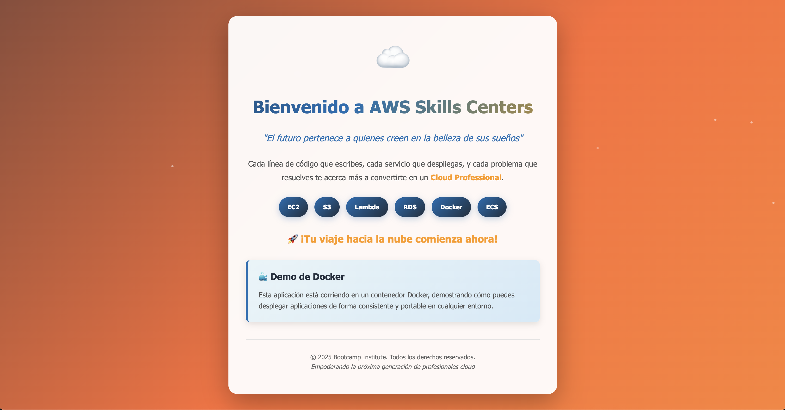
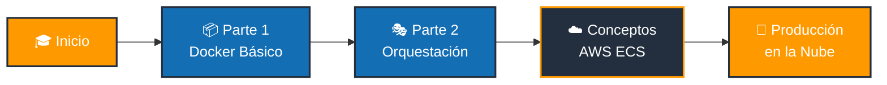
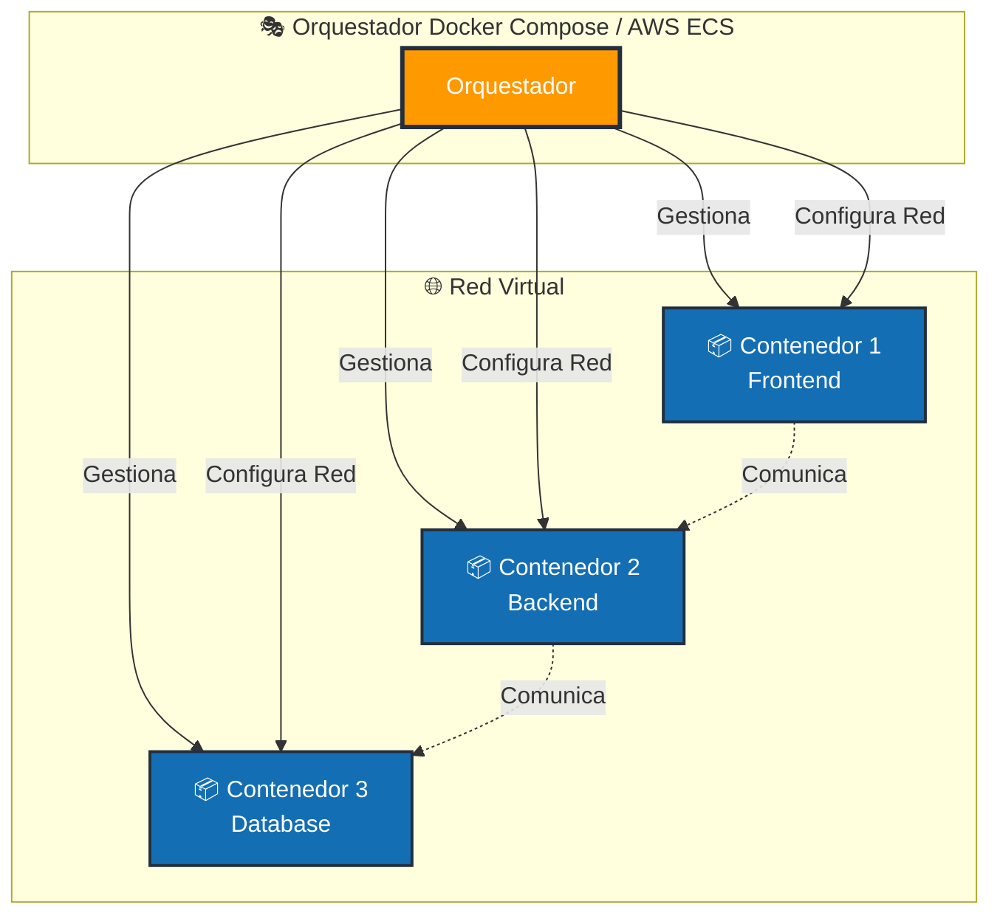
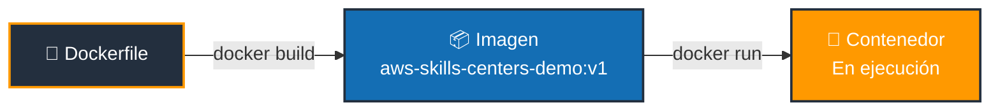
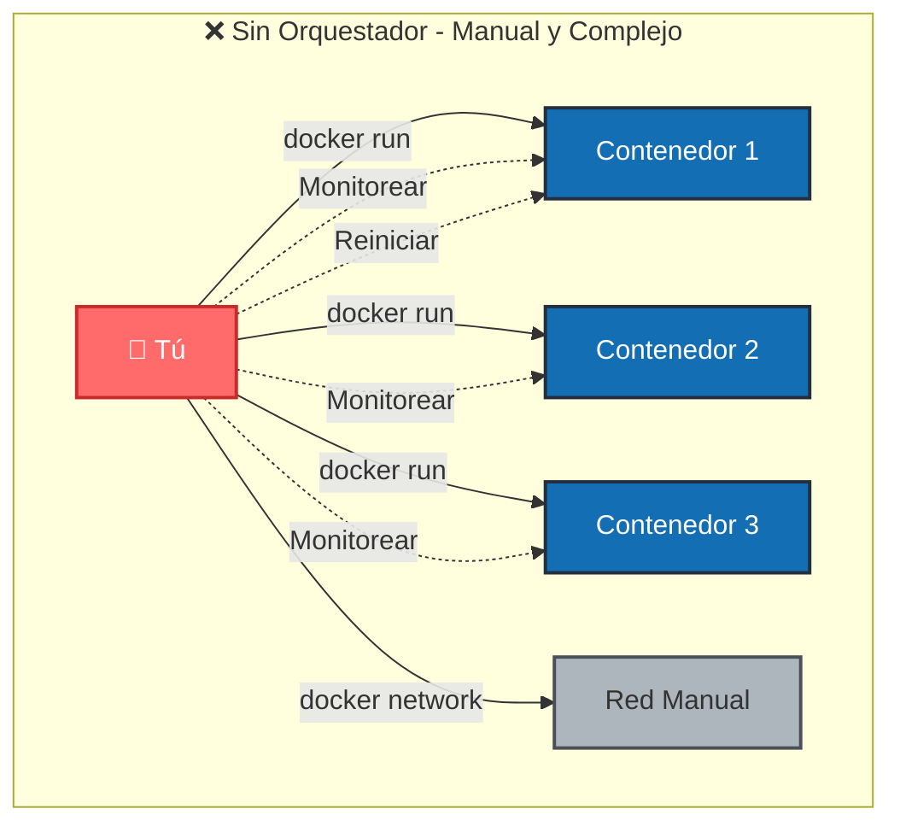
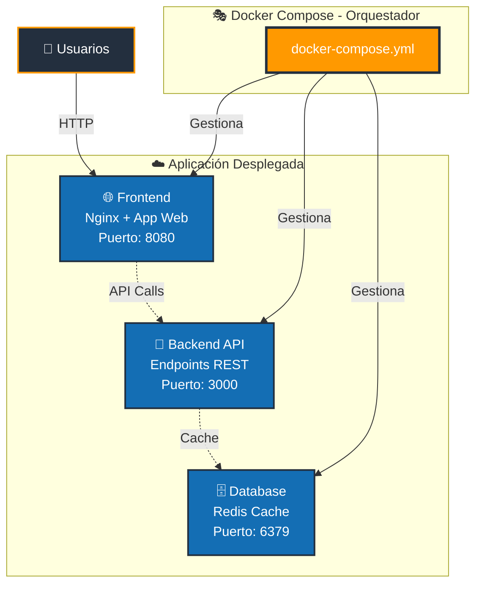
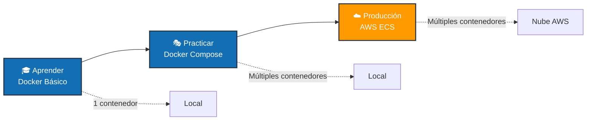
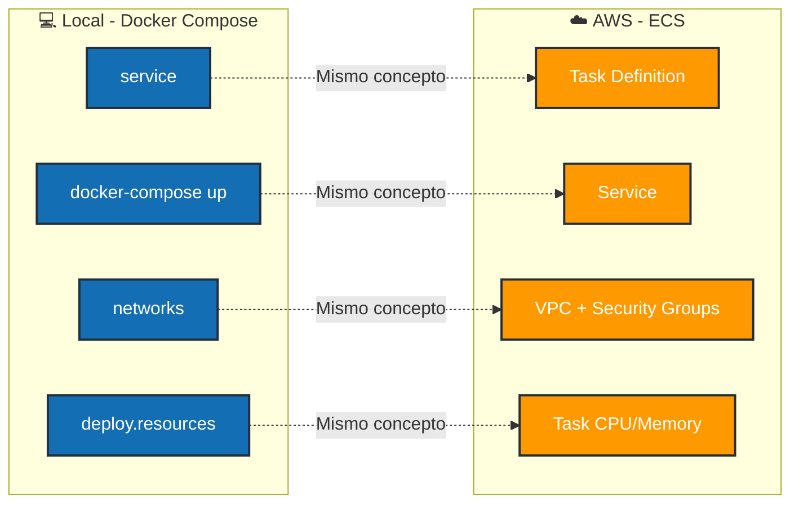

# 🐳 Demo de Docker - AWS Skills Centers


Bienvenido al repositorio de demostración de Docker para estudiantes de **AWS Skills Centers**. Este proyecto te enseñará los fundamentos de Docker y la orquestación de contenedores, preparándote para comprender servicios como **AWS ECS** (Elastic Container Service).

> 🎓 **Recurso Educativo Gratuito** | Creado para [AWS Skills Centers](https://aws.amazon.com/es/training/skills-centers/) | ⭐ Si te gusta, dale una estrella

---

## 🌟 Sobre AWS Skills Centers

Este proyecto es parte del ecosistema educativo de **AWS Skills Centers**, donde ofrecemos:

- ✅ Formación **100% GRATUITA** en tecnologías cloud
- ✅ Clases presenciales y virtuales con instructores certificados
- ✅ Desde nivel principiante hasta avanzado
- ✅ Sin requisitos previos - ¡todos son bienvenidos!

**📍 Ubicaciones:** Seattle, Arlington, Ciudad del Cabo  
**🌐 Clases virtuales en español:** Ahora disponible para toda LATAM con [Bootcamp Institute](https://bootcamp.institute)  
**🚀 Regístrate GRATIS:** [aws.amazon.com/es/training/skills-centers](https://aws.amazon.com/es/training/skills-centers/)

---

## 📸 Vista Previa de la Aplicación



*Aplicación web con animación de gradiente y diseño moderno inspirado en AWS* ☁️

---

## 🎯 Objetivo del Curso

Este demo está diseñado en **dos partes progresivas**:



### Parte 1️⃣: Docker Básico (Sin Orquestador)
Aprenderás a trabajar con un solo contenedor, entendiendo los conceptos fundamentales:
- 📦 Construcción de imágenes
- 🚀 Ejecución de contenedores
- 🔧 Gestión manual de contenedores
- 🔌 Mapeo de puertos
- ♻️ Ciclo de vida de contenedores

### Parte 2️⃣: Orquestación con Docker Compose
Aprenderás cómo un **orquestador** simplifica la gestión de múltiples contenedores:
- 📝 Definición declarativa de servicios
- 🎯 Gestión de múltiples contenedores como una unidad
- 🌐 Networking automático entre contenedores
- ⚖️ Escalabilidad y dependencias
- ☁️ **Fundamentos para entender AWS ECS**

> 💡 **¿Por qué esto es importante?** Docker Compose te enseña los conceptos de orquestación que luego verás en AWS ECS, pero todo de forma local, sin costos y sin necesidad de cuenta AWS.

---

## 📚 ¿Qué es la Orquestación?

**Orquestación** es la gestión automatizada, coordinación y organización de múltiples contenedores. Un orquestador:

- 🎭 **Gestiona el ciclo de vida** de múltiples contenedores
- 🔗 **Configura las redes** entre contenedores automáticamente
- ⚖️ **Balancea la carga** y escala servicios
- 🔄 **Reinicia contenedores** si fallan
- 📦 **Define dependencias** entre servicios



**Docker Compose** es un orquestador simple para ambientes locales.  
**AWS ECS** es un orquestador empresarial en la nube que usa los mismos conceptos.

---

## 📋 Requisitos Previos

Antes de comenzar, asegúrate de tener instalado:

- **Docker Desktop** (versión 20.10 o superior)
  - [Descargar para Windows](https://docs.docker.com/desktop/install/windows-install/)
  - [Descargar para Mac](https://docs.docker.com/desktop/install/mac-install/)
  - [Descargar para Linux](https://docs.docker.com/desktop/install/linux-install/)

Para verificar la instalación:
```bash
docker --version
docker-compose --version
```

---

# PARTE 1️⃣: Docker Básico (Sin Orquestador)

## 🚀 Paso 1: Construir la Imagen

Una **imagen** es una plantilla inmutable que contiene tu aplicación y todas sus dependencias.



```bash
# Navega al directorio del proyecto
cd docker-demo

# Construye la imagen desde el Dockerfile
docker build -t aws-skills-centers-demo:v1 .
```

**¿Qué hace este comando?**
- 🏗️ `build`: Construye una nueva imagen
- 🏷️ `-t`: Asigna un nombre (tag) a la imagen
- 📛 `aws-skills-centers-demo:v1`: Nombre y versión de la imagen
- 📂 `.`: Usa el Dockerfile del directorio actual

**Verifica que la imagen se creó:**
```bash
docker images
```

Deberías ver algo como:
```
REPOSITORY                  TAG       IMAGE ID       CREATED         SIZE
aws-skills-centers-demo     v1        abc123def456   2 seconds ago   24.5MB
```

---

## 🎬 Paso 2: Ejecutar el Contenedor

Un **contenedor** es una instancia en ejecución de una imagen.

```bash
# Ejecuta el contenedor
docker run -d -p 8080:80 --name aws-skills-centers-web aws-skills-centers-demo:v1
```

**¿Qué hace este comando?**
- `run`: Crea y ejecuta un contenedor
- `-d`: Modo "detached" (segundo plano)
- `-p 8080:80`: Mapea el puerto 8080 del host al puerto 80 del contenedor
- `--name`: Asigna un nombre al contenedor
- `aws-skills-centers-demo:v1`: La imagen a usar

---

## 🌐 Paso 3: Acceder a la Aplicación

Abre tu navegador y visita: **http://localhost:8080**

Deberías ver una hermosa página con animación de gradiente y mensaje motivacional.

---

## 🔍 Paso 4: Inspeccionar el Contenedor

### Ver contenedores en ejecución
```bash
docker ps
```

Salida esperada:
```
CONTAINER ID   IMAGE                          COMMAND                  STATUS         PORTS                  NAMES
abc123def456   aws-skills-centers-demo:v1     "/docker-entrypoint.…"   Up 2 minutes   0.0.0.0:8080->80/tcp   aws-skills-centers-web
```

### Ver logs del contenedor
```bash
docker logs aws-skills-centers-web

# Ver logs en tiempo real (Ctrl+C para salir)
docker logs -f aws-skills-centers-web
```

### Inspeccionar detalles del contenedor
```bash
docker inspect aws-skills-centers-web
```

### Ejecutar comandos dentro del contenedor
```bash
docker exec -it aws-skills-centers-web sh

# Una vez dentro, puedes explorar:
ls -la /usr/share/nginx/html/
cat /usr/share/nginx/html/index.html
exit
```

---

## 🛠️ Paso 5: Gestión del Contenedor

### Detener el contenedor
```bash
docker stop aws-skills-centers-web
```

### Verificar que está detenido
```bash
docker ps -a
```
El STATUS mostrará "Exited"

### Reiniciar el contenedor
```bash
docker start aws-skills-centers-web
```

### Eliminar el contenedor
```bash
# Primero detenlo si está corriendo
docker stop aws-skills-centers-web

# Luego elimínalo
docker rm aws-skills-centers-web
```

---

## 💭 Reflexión: ¿Qué Problemas Tiene Esta Aproximación?

Con Docker básico, para gestionar **múltiples contenedores** tendrías que:



❌ Ejecutar múltiples comandos `docker run` manualmente  
❌ Configurar las redes entre contenedores manualmente  
❌ Gestionar el orden de inicio de los servicios  
❌ Reiniciar cada contenedor individualmente si algo falla  
❌ Recordar todos los parámetros de cada contenedor  

**Solución:** ¡Necesitamos un ORQUESTADOR! 🎭

---

# PARTE 2️⃣: Orquestación con Docker Compose

## 🎭 ¿Qué es Docker Compose?

Docker Compose es un **orquestador de contenedores** que te permite:

✅ Definir múltiples servicios en un solo archivo (YAML)  
✅ Levantar toda tu aplicación con un solo comando  
✅ Gestionar redes y volúmenes automáticamente  
✅ Escalar servicios fácilmente  
✅ Definir dependencias entre servicios  

**Es similar a AWS ECS**, pero para tu máquina local.

---

## 📁 Estructura de la Aplicación Multi-Contenedor

Para demostrar la orquestación, vamos a desplegar:



**Con un SOLO comando** (`docker-compose up`), el orquestador:
- ✅ Construye todas las imágenes
- ✅ Crea la red virtual
- ✅ Inicia los servicios en orden
- ✅ Gestiona la comunicación entre ellos

---

## 🚀 Paso 1: Crear la Aplicación Completa

Ya tenemos los archivos preparados:
- `docker-compose.yml` - Define TODOS los servicios
- `index.html`, `styles.css`, `script.js` - Frontend
- `api/` - Backend (lo crearemos ahora)

---

## 🎬 Paso 2: Levantar Todos los Servicios

Con un **SOLO COMANDO**, Docker Compose:
1. Construye las imágenes necesarias
2. Crea una red para los contenedores
3. Inicia todos los servicios en el orden correcto
4. Configura el networking automáticamente

```bash
docker-compose up -d
```

**¿Qué hace este comando?**
- `up`: Inicia todos los servicios
- `-d`: Modo detached (segundo plano)

---

## 🔍 Paso 3: Ver los Servicios Orquestados

### Ver todos los servicios corriendo
```bash
docker-compose ps
```

Salida esperada:
```
NAME                        STATUS              PORTS
aws-skills-centers-web      running             0.0.0.0:8080->80/tcp
```

### Ver logs de todos los servicios
```bash
docker-compose logs

# Ver logs en tiempo real
docker-compose logs -f

# Ver logs de un servicio específico
docker-compose logs aws-skills-centers-demo
```

---

## 🌐 Paso 4: Acceder a la Aplicación Orquestada

Abre tu navegador: **http://localhost:8080**

La aplicación ahora está siendo gestionada por el orquestador.

---

## 📊 Paso 5: Entender la Configuración del Orquestador

Abre `docker-compose.yml` y observa:

```yaml
version: '3.8'

services:
  # Cada "service" es un contenedor
  aws-skills-centers-demo:
    build: .
    ports:
      - "8080:80"
    restart: unless-stopped  # ¡El orquestador reinicia si falla!
    deploy:
      resources:            # Control de recursos
        limits:
          cpus: '0.5'
          memory: 128M

networks:
  default:
    name: aws-skills-centers-network  # Red automática
```

**Ventajas del Orquestador:**
- ✅ Configuración declarativa (describes QUÉ quieres, no CÓMO)
- ✅ Reproducible (mismo resultado siempre)
- ✅ Versionable (puedes guardarlo en Git)
- ✅ Documentación como código

---

## ⚖️ Paso 6: Escalar Servicios (Poder del Orquestador)

```bash
# Escalar a 3 instancias del servicio
docker-compose up -d --scale aws-skills-centers-demo=3
```

> ⚠️ **Nota:** Para que esto funcione correctamente con puertos, necesitarías un load balancer. En AWS ECS, esto se hace automáticamente con ALB (Application Load Balancer).

---

## 🔄 Paso 7: Actualizar la Aplicación

### Hacer un cambio
Edita `index.html` y cambia el mensaje.

### Reconstruir y redesplegar
```bash
docker-compose up -d --build
```

El orquestador:
1. Reconstruye la imagen
2. Detiene el contenedor viejo
3. Inicia el contenedor nuevo
4. Mantiene el servicio disponible

---

## 🛑 Paso 8: Detener Todos los Servicios

```bash
# Detener todos los servicios
docker-compose stop

# Detener Y eliminar contenedores, redes
docker-compose down

# Detener, eliminar Y borrar imágenes
docker-compose down --rmi all

# Eliminar también volúmenes
docker-compose down -v
```

**Con un solo comando** gestionas toda tu aplicación.

---

## 🌟 Comparación: Docker vs Docker Compose vs AWS ECS



| Aspecto | Docker Básico | Docker Compose | AWS ECS |
|---------|---------------|----------------|---------|
| **🎯 Ámbito** | 1 contenedor | Múltiples contenedores locales | Múltiples contenedores en la nube |
| **⌨️ Comandos** | Múltiples `docker run` | Un `docker-compose up` | Definición de Task + Service |
| **🌐 Networking** | Manual | Automático (local) | Automático (VPC, ALB) |
| **⚖️ Escalado** | Manual | `--scale` | Auto Scaling Groups |
| **🔄 Alta disponibilidad** | No | Limitada | Sí (multi-AZ) |
| **♻️ Reinicio automático** | Con `--restart` | Con `restart: always` | Automático |
| **⚡ Load Balancer** | No | No (necesitas nginx) | ALB/NLB integrado |
| **💰 Costo** | Gratis (local) | Gratis (local) | Pagas por recursos AWS |
| **📝 Configuración** | Línea de comandos | `docker-compose.yml` | Task Definitions (JSON) |

---

## 🎓 Conceptos Clave para AWS ECS

Al aprender Docker Compose, entiendes estos conceptos que se traducen directamente a ECS:



| Docker Compose | AWS ECS | Concepto |
|----------------|---------|----------|
| 📝 `service` | ☁️ Task Definition | Cómo correr un contenedor |
| 🚀 `docker-compose up` | ⚡ Service | Instancia corriendo |
| 🌐 `networks` | 🔒 VPC + Security Groups | Networking |
| ⏱️ `depends_on` | 🔗 Service Dependencies | Orden de inicio |
| 💾 `deploy.resources` | 📊 Task CPU/Memory | Límites de recursos |
| 📈 `replicas` | 🎯 Desired Count | Cuántas instancias |
| 💻 Host local | ☁️ ECS Cluster | Dónde corren los contenedores |

---

## 🎯 Ejercicios Prácticos

### 🟢 Nivel Principiante - Parte 1 (Docker Básico)

1. **Ejercicio 1:** Construye una imagen con un tag diferente `v2`
2. **Ejercicio 2:** Ejecuta el contenedor en el puerto 3000 en lugar de 8080
3. **Ejercicio 3:** Entra al contenedor y modifica el archivo `index.html` desde dentro
4. **Ejercicio 4:** Lista todas las imágenes y elimina la versión `v1`

### 🟡 Nivel Intermedio - Parte 2 (Docker Compose)

5. **Ejercicio 5:** Modifica el `docker-compose.yml` para agregar variables de entorno
6. **Ejercicio 6:** Agrega un volumen para persistir logs
7. **Ejercicio 7:** Cambia el límite de memoria a 256MB
8. **Ejercicio 8:** Crea un segundo servicio en `docker-compose.yml`

### 🔴 Nivel Avanzado - Preparación para ECS

9. **Ejercicio 9:** Crea un `docker-compose.yml` con 3 servicios que se comuniquen
10. **Ejercicio 10:** Implementa health checks personalizados
11. **Ejercicio 11:** Simula un despliegue blue-green
12. **Ejercicio 12:** Investiga cómo convertir tu `docker-compose.yml` a Task Definition de ECS

---

## 🐛 Solución de Problemas

### Docker Básico

**El puerto 8080 ya está en uso**
```bash
# Opción 1: Usa otro puerto
docker run -d -p 3000:80 --name aws-skills-centers-web aws-skills-centers-demo:v1

# Opción 2: Encuentra qué está usando el puerto
lsof -i :8080  # Mac/Linux
netstat -ano | findstr :8080  # Windows
```

**Error: Conflicto de nombres**
```bash
# Elimina el contenedor existente
docker rm -f aws-skills-centers-web
```

### Docker Compose

**Error: Puerto en uso**
```bash
# Cambia el puerto en docker-compose.yml
ports:
  - "3000:80"
```

**Los cambios no se reflejan**
```bash
# Fuerza la reconstrucción
docker-compose up -d --build --force-recreate
```

**Ver qué contenedores están usando recursos**
```bash
docker stats
```

---

## 📚 Recursos Adicionales

### Documentación
- [Docker Docs](https://docs.docker.com/)
- [Docker Compose Docs](https://docs.docker.com/compose/)
- [AWS ECS Documentation](https://docs.aws.amazon.com/ecs/)
- [Docker to ECS Migration](https://docs.docker.com/cloud/ecs-integration/)

### Herramientas
- [Docker Desktop](https://www.docker.com/products/docker-desktop/)
- [Compose Specification](https://compose-spec.io/)
- [ECS CLI](https://docs.aws.amazon.com/AmazonECS/latest/developerguide/ECS_CLI.html)

---

## 🚀 Próximos Pasos en tu Viaje Cloud

Una vez que domines este proyecto:

1. **Amazon ECR (Elastic Container Registry)**
   - Almacena tus imágenes Docker en AWS
   - Similar a Docker Hub, pero integrado con AWS

2. **Amazon ECS (Elastic Container Service)**
   - Orquestador de AWS (como Docker Compose, pero en la nube)
   - Task Definitions = docker-compose.yml
   - Services = instancias corriendo

3. **AWS Fargate**
   - ECS sin gestionar servidores
   - Solo defines contenedores, AWS gestiona la infraestructura

4. **Amazon EKS (Elastic Kubernetes Service)**
   - Kubernetes en AWS (orquestador más avanzado)

5. **CI/CD con Docker**
   - AWS CodePipeline + CodeBuild
   - Automatiza build → push → deploy

---

## 🤝 Contribuciones

¿Tienes ideas para mejorar este demo?

1. Fork del repositorio
2. Crea una rama (`git checkout -b feature/MejorFeature`)
3. Commit tus cambios (`git commit -m 'Agregar MejorFeature'`)
4. Push a la rama (`git push origin feature/MejorFeature`)
5. Abre un Pull Request

---

## 📜 Licencia

Este proyecto ha sido desarrollado con fines educativos para el programa AWS Skills Centers.

---

## 👥 Créditos

**© 2025 Bootcamp Institute. Todos los derechos reservados.**

Desarrollado con ❤️ para empoderar la próxima generación de profesionales cloud.

---

## 🎓 ¡Regístrate en AWS Skills Centers!

¿Te gustó este demo? **Lleva tu aprendizaje al siguiente nivel** con clases gratuitas de AWS.

### 🌟 AWS Skills Centers ofrece:

- ✅ **Clases 100% gratuitas** presenciales y virtuales
- ✅ **Instructores certificados de AWS** en vivo
- ✅ **Exhibiciones interactivas** (robótica, ML, IoT)
- ✅ **Eventos de networking** con empleadores
- ✅ **Preparación para certificaciones AWS**
- ✅ **Abierto a todos** - sin requisitos previos
- 🌎 **Para LATAM:** Formación en español con [Bootcamp Institute](https://bootcamp.institute)

### 📍 Ubicaciones:

- 🇺🇸 Seattle, Washington
- 🇺🇸 Arlington, Virginia
- 🇿🇦 Ciudad del Cabo, Sudáfrica
- 🌎 **Clases virtuales en español para toda LATAM** con [Bootcamp Institute](https://bootcamp.institute)

### 🚀 Regístrate Ahora:

👉 **[https://aws.amazon.com/es/training/skills-centers/](https://aws.amazon.com/es/training/skills-centers/)**

> "Los AWS Skills Centers son el lugar donde los curiosos con respecto a la nube pueden descubrir nuevas posibilidades profesionales."

---

## 🌐 Conecta

¿Tienes preguntas o quieres profundizar más?

- 👨‍🏫 **Instructor:** Gabriel - [AWS Hero](https://builder.aws.com/community/@awshero)
- 🎓 **Bootcamp Institute:** Formación en Cloud Computing para LATAM - [bootcamp.institute](https://bootcamp.institute)
- 💬 **Comunidad AWS Skills Centers:** [aws.amazon.com/es/training/skills-centers](https://aws.amazon.com/es/training/skills-centers/)
- 🐛 **Reporta issues:** [GitHub Issues](https://github.com/gabanox/docker-demo-aws-skills-centers/issues)

---

## 🎯 Resumen del Aprendizaje

### ✅ Has Aprendido:

**Parte 1 - Docker Básico:**
- ✅ Qué es una imagen y un contenedor
- ✅ Cómo construir imágenes con Dockerfile
- ✅ Cómo ejecutar y gestionar contenedores individuales
- ✅ Comandos esenciales de Docker
- ✅ Las limitaciones de gestionar contenedores manualmente

**Parte 2 - Orquestación:**
- ✅ Qué es un orquestador y por qué lo necesitas
- ✅ Cómo Docker Compose simplifica la gestión de múltiples contenedores
- ✅ Configuración declarativa vs imperativa
- ✅ Conceptos que se traducen directamente a AWS ECS
- ✅ Fundamentos para trabajar con contenedores en producción

### 🚀 ¡Recuerda!

> "El futuro pertenece a quienes creen en la belleza de sus sueños"

Cada contenedor que despliegas, cada servicio que orquestas, te acerca más a convertirte en un **Cloud Professional**. ¡Sigue adelante!

**#AWSSkillsCenters #Docker #DockerCompose #CloudComputing #BootcampInstitute #ECS**
